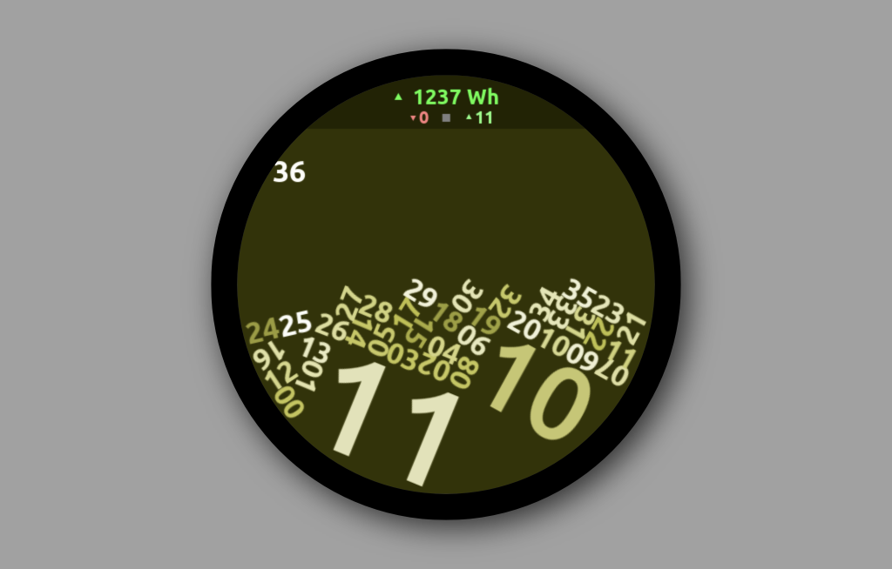

# dsmr-clock
A nice raspberry pi clock that also shows power usage from a smart meter.

Inside this repository are two folders:

## P1
One is a simple web service that I run on my raspberry pi zero that is connected to my smart meter. It's made in javascript and express.

## PI
This is the actual clock app. Everything in it is hardcoded, so it won't work without changes. It's currently set up to render using SDL on a canvas of 480x480 pixels, which is the size of the round display I use it on. You also need to get 'Arial Unicode MS.ttf' from somewhere, as it uses it for the up and down arrow symbols.

## What do I need

### For the meter reader
- A raspberry PI. I use a pi zero w
- A recent version of nodejs and npm
- A P1 to USB interface to connect to the meter

### For the clock
- A raspberry PI. I use a pi zero w2.
- A 64 bit linux operating system.
- Swift
- SDL2, SDL2 TTF, SDL2 Image libraries.
- Chipmunk physics library.

I run the clock on a 2.1" pimoroni hyperpixel round display. The raspberry pi zero is not able to compile the swift code; it runs out of memory. So you'll probably need a raspberry pi 4 or 4 with some more memory to actually compile an executable.

## License
All code is MIT licensed, except for the Ubuntu fonts, they have their own license.
